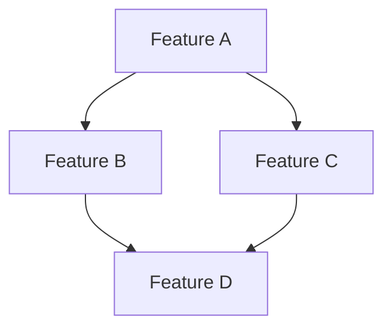

Hãy tái cấu trúc toàn bộ tài liệu requirement hiện có thành hệ thống kế hoạch và task có thể dùng để triển khai liên tục bằng Codex/AI Agent.

## Phạm vi

Folder chứa requirement hiện tại:

```text
D:\my-src\10.Developing\stocks-valuation-app\docs-dev\28.xxxx
```


Chỉ tập trung xử lý tài liệu trong folder này và các tài liệu được nó tham chiếu.

Không viết lại requirement từ đầu.

Không tự ý thay đổi source code, database schema, migration hoặc cấu hình hệ thống trong task này.

## Mục tiêu

Chuyển các requirement rời rạc hiện tại thành cấu trúc:

```text
tasks
└── planning/
    ├── README.md
    ├── PRODUCT_ROADMAP.md
    ├── REQUIREMENT_INDEX.md
    ├── DEPENDENCY_MAP.md
    ├── BACKLOG.md
    ├── plans/
    │   ├── <feature-1>.md
    │   ├── <feature-2>.md
    │   └── ...
    └── tasks/
        ├── <feature-1>/
        │   ├── README.md
        │   ├── TASK-001.md
        │   ├── TASK-002.md
        │   └── ...
        └── <feature-2>/
            └── ...
```

Hệ thống tài liệu mới phải giúp một phiên Codex mới có thể:

1. Hiểu mục tiêu của feature.
2. Biết requirement gốc nằm ở đâu.
3. Biết feature phụ thuộc vào thành phần nào.
4. Biết những task nào đã hoàn thành, đang thực hiện hoặc chưa bắt đầu.
5. Chọn một task và triển khai mà không cần đọc lại toàn bộ lịch sử chat.
6. Cập nhật trạng thái sau khi hoàn thành task.

## Bước 1: Đọc và lập danh mục requirement hiện có

Đọc toàn bộ file trong folder requirement, bao gồm:

* Markdown.
* Text.
* JSON hoặc YAML dùng để mô tả requirement.
* Mermaid diagram.
* File plan, note, TODO hoặc specification cũ.
* Các link nội bộ giữa tài liệu.

Trước khi tái cấu trúc, hãy lập danh sách:

* Tên file.
* Chủ đề chính.
* Feature hoặc module liên quan.
* Requirement chính.
* Trạng thái nếu có.
* Nội dung trùng lặp.
* Nội dung mâu thuẫn.
* Nội dung chưa rõ.
* Dependency được nhắc tới.
* Requirement có thể kiểm thử.
* Requirement chỉ mang tính ý tưởng hoặc định hướng.

Không suy diễn requirement mới khi tài liệu không đề cập.

Nếu cần diễn giải để chuyển thành task, phải giữ nguyên ý nghĩa nghiệp vụ ban đầu.

## Bước 2: Phân loại requirement

Phân loại mỗi requirement theo cấp:

```text
Product Goal
  → Epic
    → Feature
      → Requirement
        → Implementation Plan
          → Task
            → Acceptance Criteria
```

Áp dụng các định nghĩa sau:

### Product Goal

Mục tiêu sản phẩm hoặc kết quả kinh doanh cấp cao.

### Epic

Nhóm chức năng lớn, có thể kéo dài qua nhiều đợt triển khai.

Ví dụ:

* Valuation Engine.
* Market Intelligence.
* News Processing.
* SaaS & Billing.
* Notifications.
* Data Collection.

### Feature

Một năng lực cụ thể mà người dùng hoặc hệ thống nhận được.

Ví dụ:

* Thu thập tin tức từ CafeF.
* Phân loại bài viết bằng AI.
* Xây dựng CompanyProfile.
* Tính valuation scenario.
* Quản lý entitlement theo plan.

### Requirement

Hành vi hoặc ràng buộc cụ thể cần đáp ứng.

### Plan

Thiết kế triển khai một feature, gồm phạm vi, dependency, các phase và chiến lược kiểm thử.

### Task

Đơn vị công việc đủ nhỏ để một Codex session có thể triển khai và kiểm tra độc lập.

## Bước 3: Tạo `REQUIREMENT_INDEX.md`

Tạo bảng ánh xạ toàn bộ requirement:

```md
# Requirement index

| ID | Requirement | Epic | Feature | Source | Status | Plan | Notes |
|---|---|---|---|---|---|---|---|
| REQ-001 | ... | ... | ... | ../requirements/file.md | Defined | plans/feature.md | ... |
```

Mỗi requirement phải có ID ổn định:

```text
REQ-001
REQ-002
REQ-003
```

Không tạo hai ID cho cùng một requirement trùng lặp.

Khi nhiều tài liệu mô tả cùng requirement, ghi tất cả source liên quan.

Nếu hai tài liệu mâu thuẫn:

* Không tự chọn một phiên bản.
* Đánh dấu trạng thái `Conflict`.
* Ghi rõ nội dung mâu thuẫn.
* Đưa vào phần `Open questions`.

Các trạng thái requirement được phép:

* Draft
* Defined
* Needs clarification
* Conflict
* Planned
* In progress
* Implemented
* Verified
* Deprecated

Không đánh dấu `Implemented` nếu chỉ dựa vào lời mô tả trong requirement.

## Bước 4: Tạo `PRODUCT_ROADMAP.md`

Nhóm các feature thành các giai đoạn hợp lý dựa trên dependency.

Cấu trúc:

```md
# Product roadmap

## Phase 1: Foundation

### Epic
- Feature
- Lý do cần làm trước
- Dependency
- Requirement liên quan

## Phase 2: Core capabilities

## Phase 3: Advanced capabilities

## Phase 4: Optimization
```

Roadmap phải dựa trên requirement thực tế.

Không tự gán deadline hoặc ngày hoàn thành khi tài liệu gốc không có.

Thay vì deadline, sử dụng:

* Priority.
* Dependency order.
* Readiness.
* Complexity.
* Risk.

## Bước 5: Tạo plan cho từng feature

Tạo một file trong:

```text
docs/planning/plans/<feature-name>.md
```

Tên file dùng kebab-case.

Ví dụ:

```text
news-ingestion.md
ai-news-classification.md
company-profile.md
valuation-rule-engine.md
saas-entitlements.md
```

Mỗi plan sử dụng cấu trúc:

```md
# Feature name

## Metadata

- Plan ID:
- Epic:
- Status:
- Priority:
- Requirement IDs:
- Source documents:
- Owner:
- Last updated:

## Context

Tóm tắt vấn đề mà feature cần giải quyết.

## Goal

Kết quả cụ thể cần đạt được.

## Non-goals

Những nội dung không nằm trong phạm vi của feature.

## Functional requirements

Danh sách requirement nghiệp vụ, kèm Requirement ID.

## Non-functional requirements

Ví dụ:

- Performance.
- Security.
- Reliability.
- Auditability.
- Observability.
- Maintainability.

Chỉ thêm các yêu cầu có trong tài liệu gốc hoặc suy ra trực tiếp từ constraint kỹ thuật đã ghi rõ.

## Current state

Requirement hiện mô tả hệ thống đang ở trạng thái nào.

Không khẳng định code hiện tại đã có nếu chưa kiểm tra.

## Target behavior

Mô tả hành vi mong muốn sau khi hoàn thành.

## Dependencies

- Feature dependency.
- Data dependency.
- External service dependency.
- Infrastructure dependency.
- Decision dependency.

## Data impact

- Entity hoặc bảng có thể liên quan.
- Dữ liệu đầu vào.
- Dữ liệu đầu ra.
- Migration dự kiến.

Đây chỉ là phân tích từ requirement, không được tự tạo migration.

## API impact

- Endpoint dự kiến.
- Request/response.
- Authorization.
- Error cases.

Chỉ ghi chi tiết khi requirement đã đề cập hoặc có đủ căn cứ.

## Backend impact

Các module hoặc use case dự kiến liên quan.

## Frontend impact

Các page, component hoặc interaction dự kiến liên quan.

## Background processing impact

Queue, scheduler, Hangfire, retry hoặc worker liên quan nếu requirement đề cập.

## Implementation phases

### Phase 1: Domain and contract

### Phase 2: Persistence and integration

### Phase 3: Application logic

### Phase 4: API

### Phase 5: Frontend

### Phase 6: Verification and documentation

Chỉ giữ các phase thực sự áp dụng cho feature.

## Testing strategy

- Unit test.
- Integration test.
- Contract test.
- UI test.
- Manual verification.

## Risks

## Open questions

## Completion criteria

## Task list

- [ ] TASK-XXX: ...
- [ ] TASK-XXX: ...
```

## Bước 6: Tách plan thành task

Mỗi task phải được tạo thành file riêng:

```text
docs/planning/tasks/<feature-name>/TASK-XXX.md
```

Một task phải đủ nhỏ để triển khai trong một Codex session hợp lý.

Không tạo task quá rộng như:

```text
Implement toàn bộ valuation engine
```

Thay vào đó tách thành các task có đầu vào và đầu ra rõ ràng.

Ví dụ:

```text
TASK-001: Define NewsArticle domain entity
TASK-002: Add article persistence mapping
TASK-003: Implement CafeF collector
TASK-004: Add article deduplication
TASK-005: Add ingestion background job
TASK-006: Add ingestion monitoring
```

Mỗi task có cấu trúc:

````md
# TASK-XXX: Task title

## Metadata

- Feature:
- Plan:
- Status:
- Priority:
- Requirement IDs:
- Depends on:
- Blocks:
- Estimated complexity:
- Last updated:

## Objective

Một kết quả duy nhất, rõ ràng.

## Context

Thông tin cần thiết để hiểu task mà không phải đọc toàn bộ tài liệu.

## Scope

Những việc thuộc task này.

## Out of scope

Những việc không thuộc task này.

## Inputs

- Requirement liên quan.
- Dữ liệu đầu vào.
- Existing component liên quan.
- Tài liệu cần đọc.

## Expected changes

Các loại thay đổi dự kiến:

- Domain.
- Application.
- Infrastructure.
- API.
- Frontend.
- Database.
- Tests.
- Documentation.

Không được bịa tên file nếu chưa kiểm tra repository.

Nếu chưa biết file cụ thể, ghi module hoặc khu vực dự kiến và đánh dấu `Needs code inspection`.

## Implementation steps

1. ...
2. ...
3. ...

Các bước phải theo thứ tự triển khai.

## Acceptance criteria

Sử dụng checklist có thể xác minh:

- [ ] ...
- [ ] ...
- [ ] ...

Acceptance criteria phải mô tả kết quả, không mô tả thao tác.

Không viết:

- [ ] Code đã được viết.

Nên viết:

- [ ] Article có cùng canonical URL không được lưu trùng.
- [ ] Collector failure được ghi log với source và URL.
- [ ] Job có thể chạy lại mà không tạo dữ liệu trùng.

## Verification

Các lệnh hoặc cách kiểm tra dự kiến:

```bash
dotnet build
dotnet test
npm run lint
npm run build
````

Chỉ giữ các lệnh phù hợp với task.

## Risks and edge cases

## Open questions

## Completion report

Phần này để Codex cập nhật sau khi triển khai:

* Completed at:
* Files changed:
* Tests executed:
* Result:
* Remaining issues:
* Follow-up tasks:

````

## Quy tắc chia task

Mỗi task nên:

- Có một mục tiêu chính.
- Có output cụ thể.
- Có acceptance criteria kiểm chứng được.
- Có dependency rõ ràng.
- Không sửa quá nhiều subsystem không liên quan.
- Có thể review độc lập.
- Có thể commit độc lập trong phần lớn trường hợp.

Tách task khi:

- Backend và frontend có thể triển khai riêng.
- Domain model và migration là hai bước có thể kiểm soát riêng.
- Integration với external source có retry, mapping và persistence riêng.
- Task có nhiều loại failure độc lập.
- Task có nhiều acceptance criteria không liên quan chặt chẽ.

Không tách quá nhỏ thành các task như:

- Tạo một class.
- Thêm một method.
- Đổi tên một biến.

Trừ khi đó là một phần việc độc lập có ý nghĩa.

## Bước 7: Tạo dependency map

Tạo:

```text
docs/planning/DEPENDENCY_MAP.md
````

Bao gồm:

1. Dependency giữa Epic.
2. Dependency giữa Feature.
3. Dependency giữa Task.
4. Các blocker hiện tại.
5. Các task có thể thực hiện song song.

Sử dụng Mermaid:



Ngoài diagram, thêm bảng:

```md
| Item | Depends on | Reason | Blocking |
|---|---|---|---|
```

## Bước 8: Tạo backlog

Tạo:

```text
docs/planning/BACKLOG.md
```

Nhóm backlog theo Epic và Feature.

Mỗi item có:

```md
- [ ] TASK-XXX: Task title
  - Status:
  - Priority:
  - Plan:
  - Requirement IDs:
  - Dependencies:
  - Readiness:
```

Các giá trị `Readiness`:

* Ready
* Blocked
* Needs clarification
* Needs design
* Needs code inspection

Không đánh dấu task là `Ready` khi vẫn còn open question ảnh hưởng đến cách triển khai.

## Bước 9: Tạo README hướng dẫn Codex sử dụng

Tạo:

```text
docs/planning/README.md
```

Nội dung cần hướng dẫn:

### Khi bắt đầu một feature

1. Đọc plan của feature.
2. Đọc các requirement source.
3. Kiểm tra dependency map.
4. Chọn task có trạng thái Ready.
5. Kiểm tra source code thực tế trước khi triển khai.

### Khi bắt đầu một task

1. Đọc file `TASK-XXX.md`.
2. Kiểm tra `Depends on`.
3. Kiểm tra Git status và Git diff.
4. Xác minh assumption với code thực tế.
5. Thực hiện đúng scope.
6. Chạy verification.
7. Cập nhật completion report.
8. Cập nhật status của task, plan và backlog.

### Khi hoàn thành task

Codex phải cập nhật:

* Task status.
* Acceptance criteria.
* Completion report.
* Plan progress.
* Backlog.
* Dependency map nếu dependency thay đổi.
* Requirement status nếu requirement đã được implement hoặc verified.

## Bước 10: Bảo toàn tài liệu gốc

Không xóa folder requirement gốc trong lần tái cấu trúc này.

Tài liệu mới phải tham chiếu ngược về tài liệu gốc bằng relative link.

Requirement gốc là nguồn nghiệp vụ.

Plan và task là tài liệu triển khai được sinh ra từ requirement.

Nếu phát hiện requirement trùng lặp:

* Giữ tài liệu gốc.
* Hợp nhất chúng thành một Requirement ID.
* Liệt kê tất cả source.

Nếu phát hiện requirement cũ:

* Không xóa.
* Đánh dấu `Deprecated` hoặc `Needs verification`.
* Giải thích lý do.

## Quy tắc chống suy diễn

* Không tự thêm feature mới ngoài tài liệu requirement.
* Không tự quyết định business rule còn mơ hồ.
* Không tự chuyển một ý tưởng thành requirement bắt buộc.
* Không tự đánh dấu requirement là đã implement.
* Không tự tạo deadline.
* Không tự gán owner.
* Không tự thay đổi mức ưu tiên nếu requirement đã quy định rõ.
* Không sửa source code trong task tái cấu trúc tài liệu này.
* Không làm mất ngữ cảnh, ví dụ và lý do nghiệp vụ từ tài liệu gốc.

Khi thông tin thiếu, sử dụng một trong các nhãn:

```text
Needs clarification
Needs verification
Needs code inspection
Conflict
Assumption
```

Mọi assumption phải được ghi rõ, không trình bày như sự thật.

## Cách xử lý tài liệu có cả requirement và solution

Nếu file gốc trộn lẫn:

* Vấn đề nghiệp vụ.
* Requirement.
* Giải pháp đề xuất.
* Task kỹ thuật.
* Ghi chú thảo luận.

Hãy tách như sau:

* Vấn đề nghiệp vụ → Context của plan.
* Requirement → REQUIREMENT_INDEX.
* Giải pháp đề xuất → Target design hoặc Proposed approach.
* Task kỹ thuật → Task files.
* Ghi chú chưa quyết định → Open questions.
* Quyết định đã được xác nhận → Decisions trong plan.

Không coi mọi giải pháp được viết trong requirement là quyết định cuối cùng.

## Kết quả cần báo cáo

Sau khi hoàn thành, trả về:

1. Danh sách requirement source đã đọc.
2. Số Product Goal, Epic, Feature và Requirement đã xác định.
3. Danh sách plan đã tạo.
4. Danh sách task đã tạo theo từng feature.
5. Các requirement trùng lặp đã hợp nhất.
6. Các mâu thuẫn phát hiện.
7. Các open question.
8. Các task đã sẵn sàng triển khai.
9. Các task đang bị block.
10. Cấu trúc folder mới.
11. Kết quả `git diff --stat`.
12. Xác nhận không thay đổi source code hoặc database schema.

## Cách thực hiện

Thực hiện trực tiếp việc tái cấu trúc tài liệu.

Không dừng lại chỉ để đề xuất cấu trúc.

Trước khi tạo file, hãy đọc toàn bộ folder requirement để tránh chia plan và task dựa trên một phần thông tin.

Ưu tiên chất lượng và khả năng truy vết từ:

```text
Task → Plan → Requirement ID → Requirement source
```
