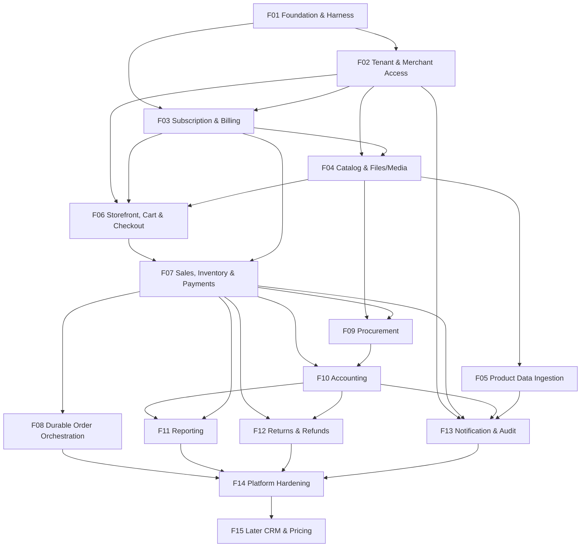
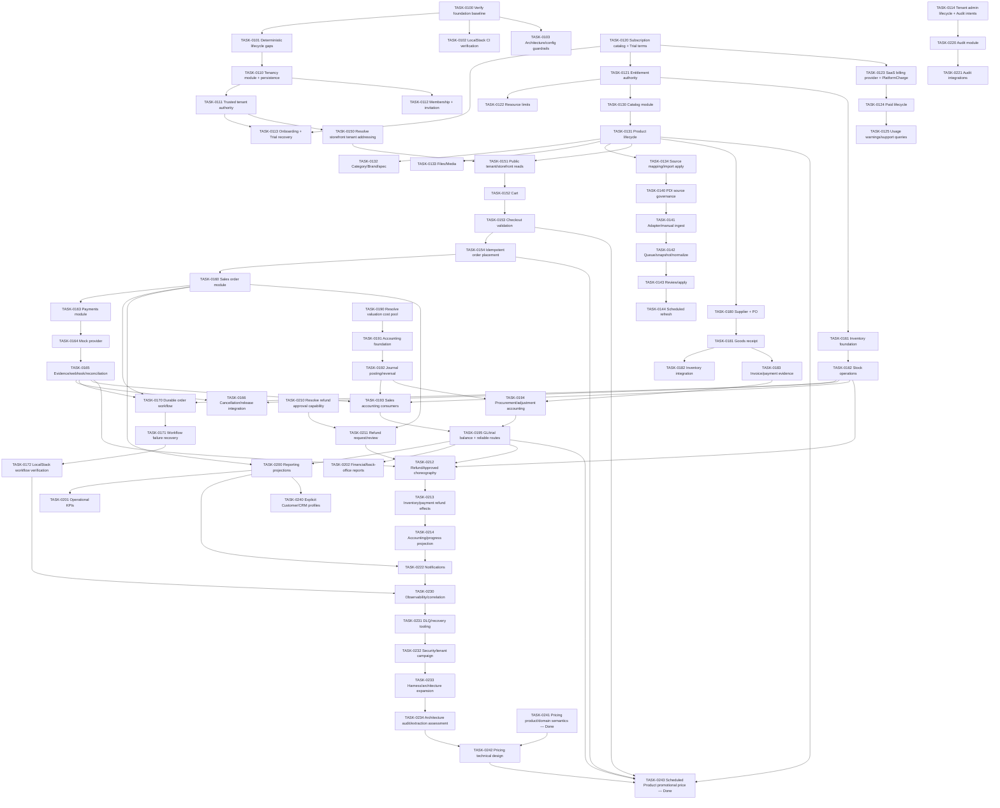

# CommerceOS Dependency Map

_Last updated: 2026-08-14_

## Feature dependency graph

## Task dependency graph — critical path

TASK-0241, TASK-0242 and TASK-0243 are complete. PD-054 plus `docs/domains/pricing-promotion.md` define the first Pricing slice; TASK-0242 records its technical design and TASK-0243 implements it without expanding the approved promotion semantics.

## Blocker table

| Blocker | Affected tasks | Resolution |
|---|---|---|
| OQ-001 Storefront Tenant public-address semantics | TASK-0150–0154 and public catalog integration | Resolved by PD-052; implement Tenant-owned globally unique `/{storefrontSlug}` binding |
| OQ-002 Accounting weighted-average cost-pool dimension | TASK-0191–0195 and refund COGS reversal | Resolved by PD-021: trusted Tenant + Product valuation pool; Warehouse is not a valuation dimension |
| OQ-003 Refund approval role/capability mapping | TASK-0211–0214 | Resolved by PD-023: Owner/Admin/Staff request; Owner/Admin approve/reject; Viewer neither |
| External source policy changes over time | TASK-0141+ | implementation-time current policy/robots/terms review; disable source if unsafe |
| Pricing first-slice lifecycle/time/base-price/public-display/history semantics | TASK-0242–0243 | **Resolved by PD-054 and `docs/domains/pricing-promotion.md` in TASK-0241**; Technical Architecture/Builder must preserve this policy rather than reinterpret it |
| Future Pricing capabilities beyond the first slice | future work | Require an explicit product decision; TASK-0243 does not introduce coupons, stacking, segment, price-list or discount-accounting semantics |

## Parallelism guidance

After TASK-0100 closes foundation uncertainty, independent work may proceed where dependencies permit. Examples: Subscription catalog bootstrap and Tenancy module work can progress in parallel when their shared contract is stable; Catalog and provider simulation can also progress independently after required foundation boundaries exist. Infrastructure-sensitive parallel tasks must use distinct LocalStack task-instance ports/resource prefixes.

TASK-0241 -> TASK-0242 -> TASK-0243 is complete. Future Pricing work must preserve the module boundary and request a new product decision before adding new promotion semantics.
