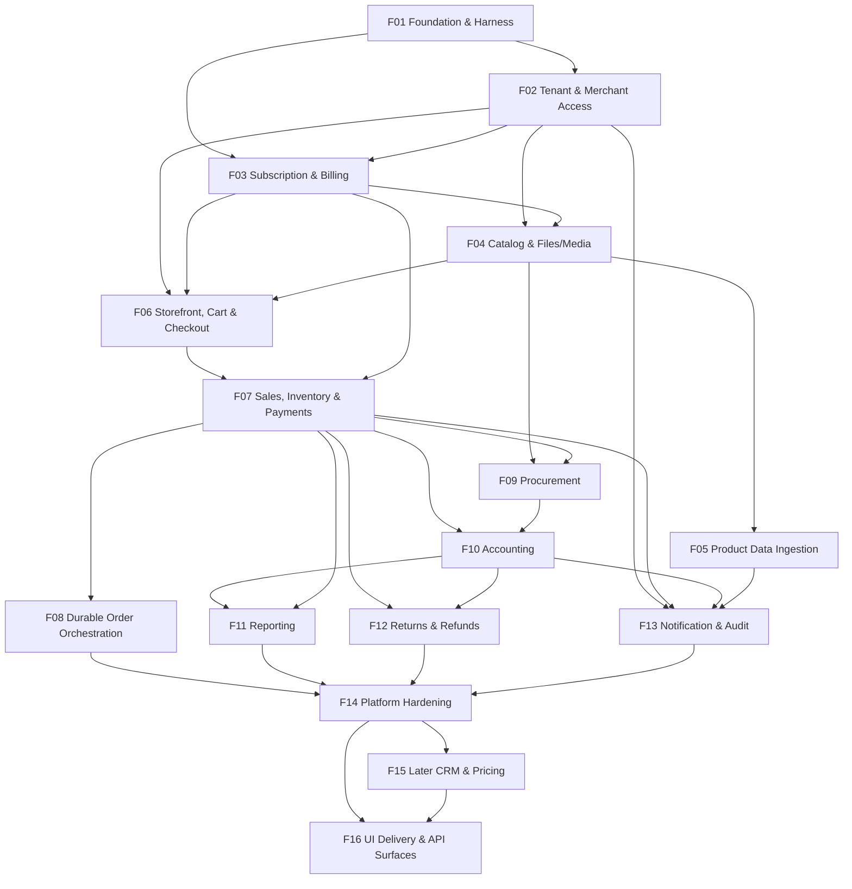
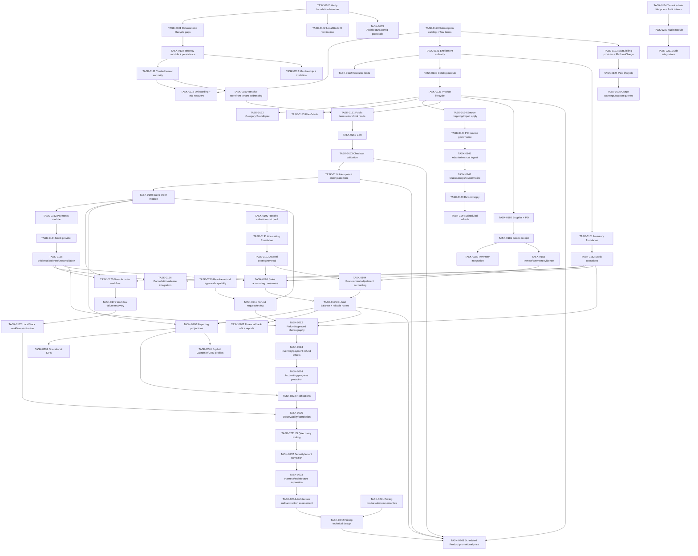
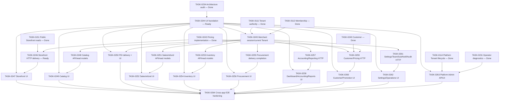

# CommerceOS Dependency Map

_Last updated: 2026-08-14_

## Feature dependency graph

## Task dependency graph — core capability path

Core capability tasks through TASK-0243 are complete at the currently planned slices. F16 adds delivery/read-model/API/UI work rather than reopening those business semantics.

## F16 task dependency graph — UI delivery

## F16 blocker table

| Blocker | Affected tasks | Resolution |
|---|---|---|
| Shared frontend routing/API/error/test conventions are not established | Most F16 UI tasks | `TASK-0244`; first Ready frontier |
| Merchant HTTP requests do not yet have a normal authenticated current-Tenant delivery context | Merchant Backoffice APIs/screens | `TASK-0245`; must derive authority from current Membership, never client `tenantId` |
| Public Storefront Application capabilities are not exposed as complete UI-oriented HTTP DTOs | SF-01..SF-05 | `TASK-0246`; independent first Ready frontier |
| Merchant Catalog list/detail and reference-list queries are incomplete | BO-10..BO-12 | `TASK-0248` |
| PDI source/enrollment/candidate list/run-status reads are incomplete | BO-13 | `TASK-0250` |
| Order detail/refund list and cross-domain operational summaries need explicit read models | BO-20..BO-22 | `TASK-0251`; no foreign-table joins |
| Warehouse/stock/movement lists and explicit adjustment-increase command are incomplete | BO-30..BO-33 | `TASK-0253` |
| Procurement Draft PO/create/update/cancel and several list/detail read surfaces are incomplete | BO-40..BO-43 | `TASK-0255`; do not invent richer PO semantics |
| Accounting/Reporting are application-ready but mostly lack HTTP/read DTO delivery | BO-01, BO-50..BO-60 | `TASK-0257` |
| Customer/Pricing are implemented but lack merchant UI delivery/list projections | BO-61..BO-62 | `TASK-0259` |
| Business/Storefront settings, Team lists, Subscription reads, Notification/Audit HTTP delivery are incomplete | BO-70..BO-75 | `TASK-0261` |
| Platform Tenant list/support dashboard contracts are incomplete | PA-01..PA-04 | `TASK-0263` |
| Safe anonymous Order history/status lookup is not approved | Any future shopper order-history screen | Not part of F16; SF-05 uses immediate placement response. A later anonymous lookup needs an opaque guest access capability/product decision. |

## Parallelism guidance

F16 begins with exactly two independent Ready tasks: `TASK-0244` and `TASK-0246`. This matches the repository's default two-Builder concurrency ceiling if automated parallel execution is used.

After `TASK-0244`, `TASK-0245` may start while `TASK-0246` finishes or `TASK-0247` begins. After `TASK-0245`, the merchant-domain API/read-model tasks (`TASK-0248`, `0251`, `0253`, `0255`, `0257`, `0259`, `0261`) are logically independent, but automated execution should still respect the default concurrency ceiling and avoid simultaneous edits to shared API composition/frontend shell files unless worktrees/ownership are isolated.

`TASK-0264` is the final integration/hardening gate and should not be used to bypass missing owner-domain contracts discovered earlier.